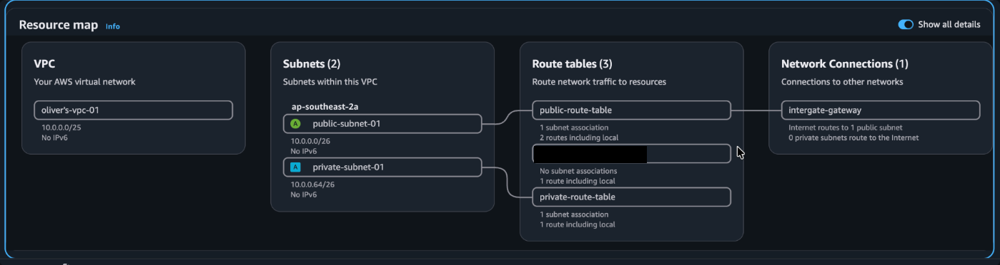
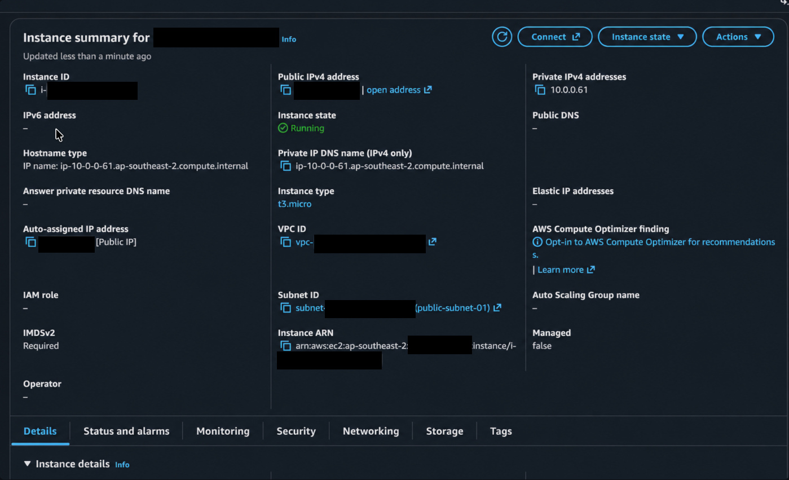
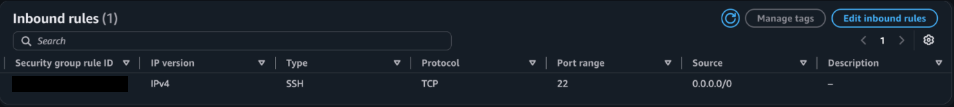
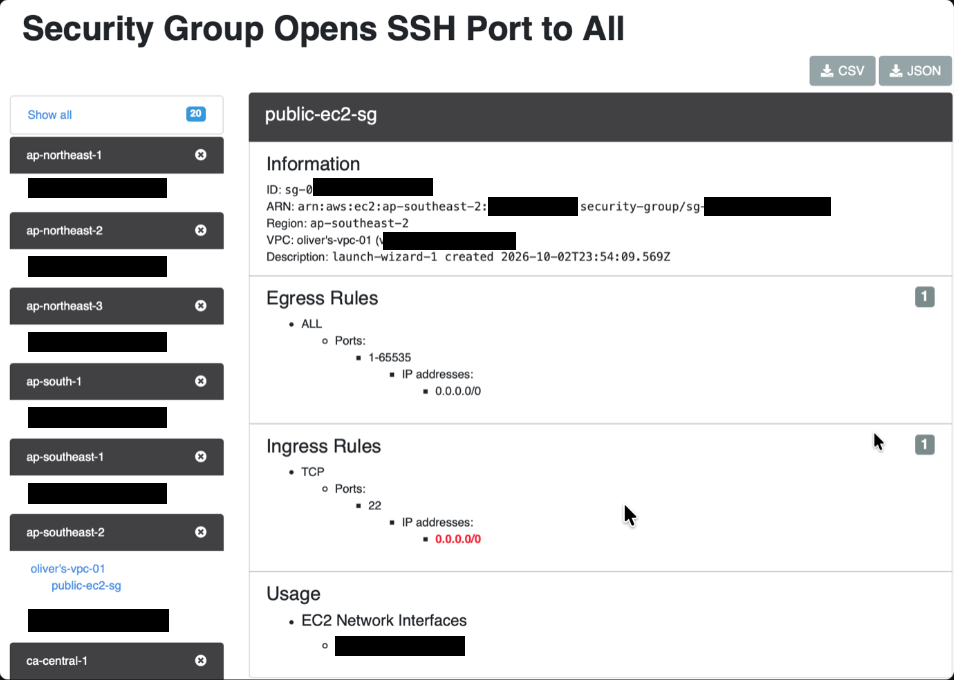
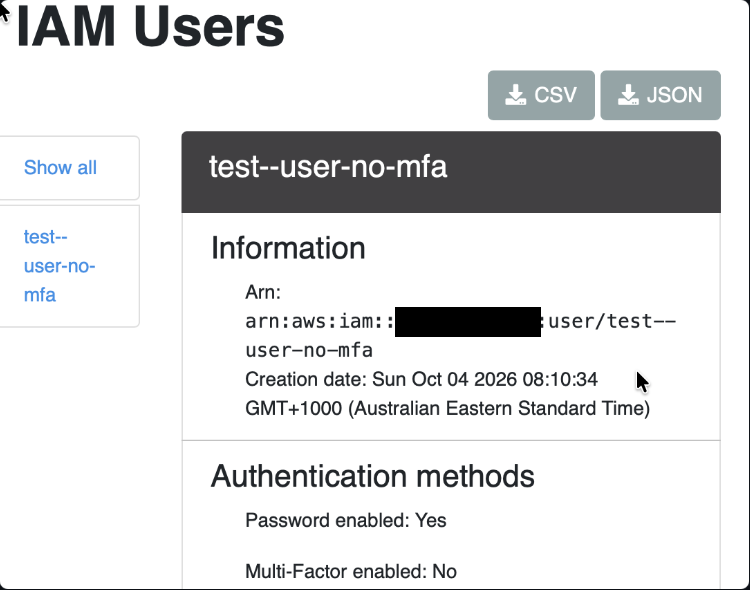
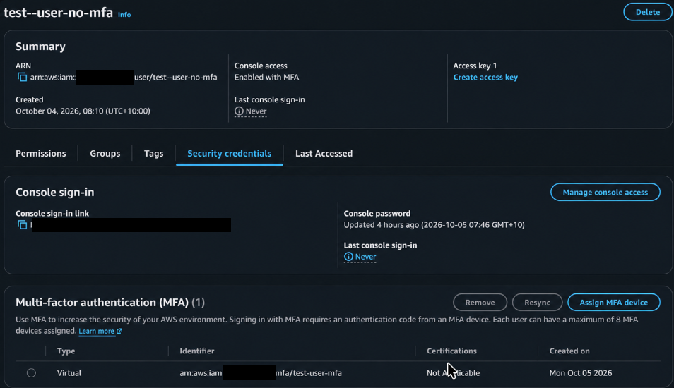

# AWS Cloud Security Audit — ScoutSuite Misconfiguration Assessment.
AWS cloud security project using ScoutSuite to identify, investigate, and remediate security misconfigurations.

This lab focuses on three test cases: SSH open to the internet, an IAM user without MFA, and disabled S3 Block Public Access settings. The remediation and validation below cover these three cases, not every finding in the AWS account.

### Step 1: Building the AWS Environment 

I created a small AWS environment to simulate a real cloud setup for the ScoutSuite security assessment.

### Network Architecture
I created a VPC with separate public and private subnets, each using its own route table. The public subnet routes internet traffic through an Internet Gateway, while the private subnet has no direct route to the internet.

A NAT Gateway could be added to allow resources in the private subnet to make outbound internet connections without allowing unsolicited inbound connections. I left this out of the lab to avoid unnecessary AWS costs.

### EC2 and Network Security

I deployed an EC2 instance in the public subnet and configured a security group to control inbound and outbound network traffic.

Inbound rules 

Outbound rules 

### S3 Storage

I created an S3 bucket with test objects to give ScoutSuite additional AWS resources to assess. Public access was blocked to keep the bucket private.

### ScoutSuite IAM Access

I created a dedicated IAM user for ScoutSuite and attached the AWS-managed SecurityAudit policy, allowing ScoutSuite to inspect the AWS environment without granting administrator access

### Step 2: Run a Baseline ScoutSuite Assessment 

Before introducing any test misconfigurations, I ran ScoutSuite to assess the current security state of my AWS environment and establish a baseline for later comparison.

**Running the Baseline ScoutSuite Assessment**

**Baseline ScoutSuite Assessment Results**

The baseline assessment identified existing findings across EC2, IAM, S3, VPC and other AWS services. These results provide a reference point before introducing controlled test misconfigurations.

### Step 3: Introduce Test Misconfigurations

Test Misconfiguration 1 - Overly Permissive SSH 
I intentionally changed the EC2 security group's SSH rule from a single trusted /32 address to 0.0.0.0/0. This exposes port 22 to connection attempts from any IPv4 address. This was introduced temporarily to test whether ScoutSuite would identify this issue.

Test Misconfiguration 2 - IAM User Without MFA

I gave the test user read-only access to S3 rather than administrative permissions. I intentionally left MFA disabled to test whether ScoutSuite would identify it as a security issue.

Test Misconfiguration 3 - Disable S3 Block Public Access

I created an S3 bucket with the Block Public Access settings disabled. This was intentionally configured as a security misconfiguration to test whether ScoutSuite would identify the potential exposure.

### Step 4: Second ScoutSuite Scan

After intentionally introducing security misconfigurations into the AWS environment, I ran a second ScoutSuite scan to determine whether the security issues could be detected. I then reviewed the findings to identify the affected resources, understand the associated security risks, and determine appropriate remediation steps.

The baseline and second scan show different numbers of resources and checks. For example, EC2 resources increased from 7 to 40 and EC2 checks from 101 to 593. The reason for this difference is not established in this write-up, so the overall finding totals are not a direct before-and-after comparison of the three test changes. The individual findings and validation results below are the evidence for each test case.

### Step 5: Remediate + Validate Findings
Finding 1: SSH Open To Internet

ScoutSuite detected that the public-ec2-sg security group allowed inbound SSH traffic on TCP port 22 from 0.0.0.0/0. This means any IPv4 address could attempt to connect to the EC2 instance over SSH.

### Remediate Finding 1: 

I changed the SSH inbound rule from 0.0.0.0/0 to my public IP /32, restricting SSH access to my network. I kept the egress rule unchanged because security groups are stateful

## Finding 2: IAM Users Without MFA 

ScoutSuite detected that test--user-no-mfa had password access enabled without MFA. If the user's password were compromised, an attacker could access the account without an additional authentication factor.

### Remediate Finding 2: 
I enabled MFA for test--user-no-mfa, adding an additional authentication factor to secure the IAM user.

## Finding 3: S3 Public Access Block Disabled

ScoutSuite detected that the S3 Public Access Block settings were disabled. This increases the risk of the bucket being accidentally exposed to the internet.

## Remediate Finding 3: 

I re-enabled Block all public access to prevent the S3 bucket from accidentally being exposed publicly through ACLs or bucket policies.

## Step 6: Final Validation Scan

After remediating the three test misconfigurations, I ran a final ScoutSuite validation scan to check the results.

## Validating Finding 1:

I reran ScoutSuite after remediation. The finding returned 0 rules flagged, confirming that SSH was no longer exposed to all source addresses.

## Validating Finding 2:

I reran ScoutSuite after enabling MFA. The finding returned 0 users flagged, confirming that the IAM user was no longer detected as being without MFA.

## Validating Finding 3: 

I verified that Block all public access was enabled again, confirming that the public-access protection had been restored.

## Additional Security Improvement: Root Account Usage 

During the project, I noticed that I had been using the AWS root account for administrative tasks. I improved the account's security by using a dedicated IAM administrator account instead and locking away the root account for tasks that specifically require it.

## Conclusion 

The project was about me building an AWS environment with a VPC, public/private subnets, route tables, an internet gateway, EC2 instance with a security group, S3 bucket, and IAM access for ScoutSuite. I purposely introduced misconfigurations into the environment to see whether ScoutSuite could detect them.

This project helped me understand not only how to build an AWS environment, but also how to investigate misconfigurations, remediate them, and validate the findings. It showed me that finding and fixing security issues in a cloud environment is not a one-step process.

Most importantly, this project improved my practical skills in investigating findings, fixing them, and validating that they were properly remediated. In future projects, I would like to go into more detail during investigations and explore more complex cloud security misconfigurations.
